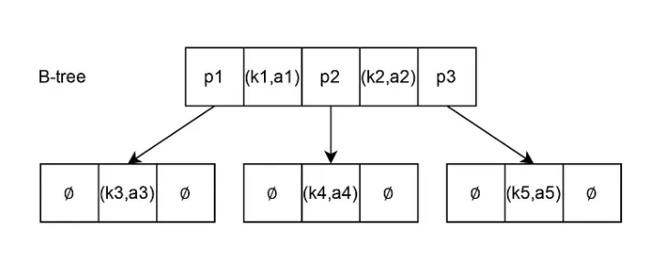
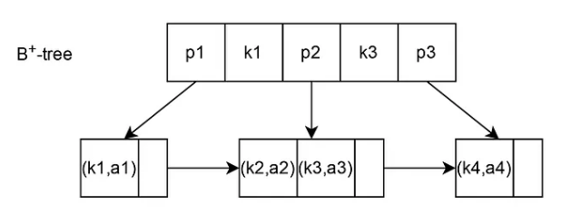

# B-Tree

B-Tree는 **Self-balancing Tree** 자료구조로, 일반적인 이진 트리(Binary Tree)와 달리 하나의 노드가 **두 개 이상의 자식 노드**를 가질 수 있는 **Multi-way Tree
구조**이다.  
이 구조 덕분에 트리의 높이가 낮게 유지되어 탐색 성능이 안정적으로 유지된다.



B-Tree의 노드는 Key와 Child Pointer로 구성되며,  
Key는 데이터를 구분하는 기준값, Pointer는 다음 노드를 가리키는 주소이다.

- (k1,a1), (k2,a2) → (Key, Value)
  key: 데이터를 정렬하고 범위를 나누는 기준이 되는 값.  
  Value: 데이터
- p1, p2, p3 → Child Pointer  
  Key 범위에 해당하는 데이터를 가진 하위 노드를 가리킨다.

## B-Tree의 주요 특징

### 정렬 상태 유지

각 노드 내부의 Key들은 항상 **오름차순으로 정렬**되어 있다.  
탐색 시 노드 내부에서 Key 범위를 비교하여 적절한 자식 노드로 이동한다.

### Multi-way Tree

하나의 노드는 여러 개의 Key와 자식 포인터를 가질 수 있다.  
트리가 가질 수 있는 **최대 자식 수를 M**이라 할 때 이를 **M차 B-Tree**라고 하며, 자식 수 = Key 수 + 1 이므로 **최대 Key 개수는 M-1개**가 된다.

### 균형 유지

B-Tree는 트리의 균형을 유지하기 위해 각 노드의 Key 개수에 **최소 제한**을 둔다.  
최소 Key 개수 = ⌈M/2⌉ - 1 (루트 노드는 예외)  
이 제한을 통해 **트리가 한쪽으로 치우치는 것을 방지하며**, 모든 **리프 노드는 항상 동일한 깊이**에 위치하게 된다.  
이로 인해 탐색, 삽입, 삭제 연산이 **O(log n)** 시간 복잡도를 가진다.

- 리프노드: 자식 포인터가 없는 노드로 트리의 가장 아래 단계에 위치한 노드이다.

### Disk I/O 최적화

B-Tree는 디스크 기반 시스템(DBMS, 파일 시스템)에서 효율적으로 동작하도록 설계된 자료구조이다.

하나의 노드는 일반적으로 디스크의 Block 크기에 맞게 구성되며, 한 번의 디스크 접근으로 여러 Key를 동시에 읽을 수 있다.

따라서 트리의 높이가 낮아지고 디스크 I/O 횟수가 줄어들어 탐색 성능이 향상된다.

## 주요 연산

### 탐색

이진 탐색 트리와 유사하지만, 노드 내부에 여러 Key가 존재하므로  
노드 내부에서 Key들을 비교한 후 **적절한 자식 포인터를 따라 내려가며 탐색**한다.

### 삽입

삽입으로 인해 노드가 허용 가능한 최대 Key 수를 초과하면,  
해당 노드를 두 개의 노드로 분할(Split)하고 중앙값(Key)을 부모 노드로 올린다.

- 참고: [25 | 40 | 60 | 80] 노드에서 중앙값은 '60'(upper median)을 사용한다.   
  4차 B-Tree에서 [10 | 20 | 30] 노드에 25가 삽입되면 최대 Key 개수 3개를 초과되므로, 중앙값 25는 부모노드로 올라가고, [10 | 20], [30] 으로 분할된다.  
  이후, 아래와 같이 진행
  ```        
         [25 | 40]
        /    |    \
  [10 | 20] [30]  ...
  ```

부모 노드에 중앙값이 삽입된 후에도 Key 개수가 최대값을 초과하면  
동일한 방식으로 분할이 상위 노드로 전파된다.

이 과정은 루트 노드까지 반복될 수 있으며,  
루트 노드가 분할되면 새로운 루트 노드가 생성되어 트리의 높이가 증가한다.

### 삭제

데이터 삭제 후 노드의 Key 수가 **최소 Key 개수 조건을 만족하지 못하면**,  
**형제 노드로부터 Key를 재분배하거나 노드를 병합**하여 균형을 유지한다.

# B+Tree

B+Tree는 B-Tree의 변형 구조로, 실제 DB 인덱스에서 가장 널리 사용되는 자료구조.



## B+Tree의 주요 특징

- Internal Node는 Key와 Child Pointer만 저장한다.
- Leaf Node는 실제 데이터 위치 정보를 저장한다.  
  DB 인덱스에서 보통 `(Key, RowID)` 형태로 저장한다. (RowID = 데이터가 저장된 위치)
- Leaf Node들이 Linked List 형태로 연결되어 있다. 때문에 Range Query에 매우 효율적
- Internal Node에 Value가 없기 때문에 더 많은 Key를 저장할 수 있다. 즉, 트리 높이가 감소하고 디스크 I/O 감소.
