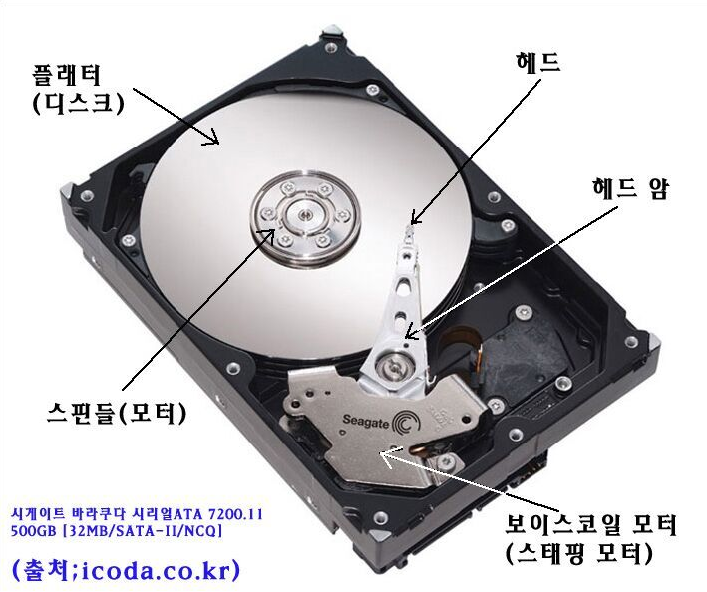

# 데이터 저장 구조

데이터베이스는 데이터를 계층적인 저장 구조로 관리한다.

```aiignore
Database
 └── Tablespace
      └── Segment
           └── Extent
                └── Block
```

## Block

- 데이터베이스에서 데이터를 읽고 쓰는 최소 단위이다.
- DB가 디스크에서 데이터를 읽을 때 항상 블록 단위로 읽는다.
- 하나의 블록에는 여러 행(Row)이 저장될 수 있다.
- 일반적으로 8KB / 16KB 크기를 사용한다.



HDD의 플래터는 매우 빠르게 회전한다. 헤드가 특정 위치에 도달했을때 한 Row만 읽고 멈추는것은 비효율적.  
따라서 헤드가 지나가는 경로에 있는 데이터를 한꺼번에 읽어 들이는데, 이것을 S/W적으로 블록(또는 페이지) 라는 단위로 정의한다.  
즉, SQL이 한 행을 조회해도 블록단위로 메모리에 올라온다. **Block → I/O 단위**

## Extent

연속된 여러 블록의 집합.

- 데이터가 증가하면 DB는 공간을 블록 단위가 아니라 Extent 단위로 확장한다.
- 디스크 단편화를 줄이기 위해 사용된다.

## Segment

데이터를 저장하는 논리적 객체의 저장 공간이다.  
Segment는 여러 Extent로 구성된다.

### 대표적인 세그먼트

- Table Segment
- Index Segment
- Undo Segment
- Temporary Segment

## Tablespace

여러 세그먼트를 담는 논리적인 저장 컨테이너이다.  
데이터파일과 연결된다.

## Datafile

데이터베이스 데이터가 실제로 저장되는 OS 파일이다.

### 특징

- 디스크에 존재
- Tablespace에 속함
- DB가 직접 관리 (예: `/data/mysql/datafile01.dbf`)